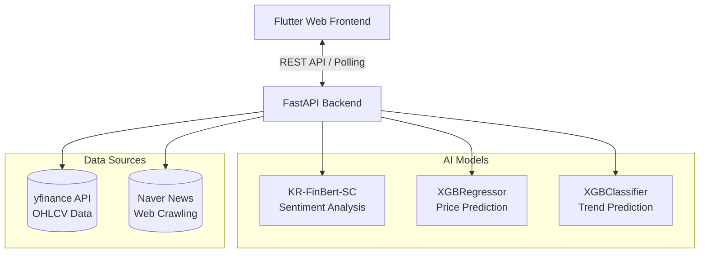
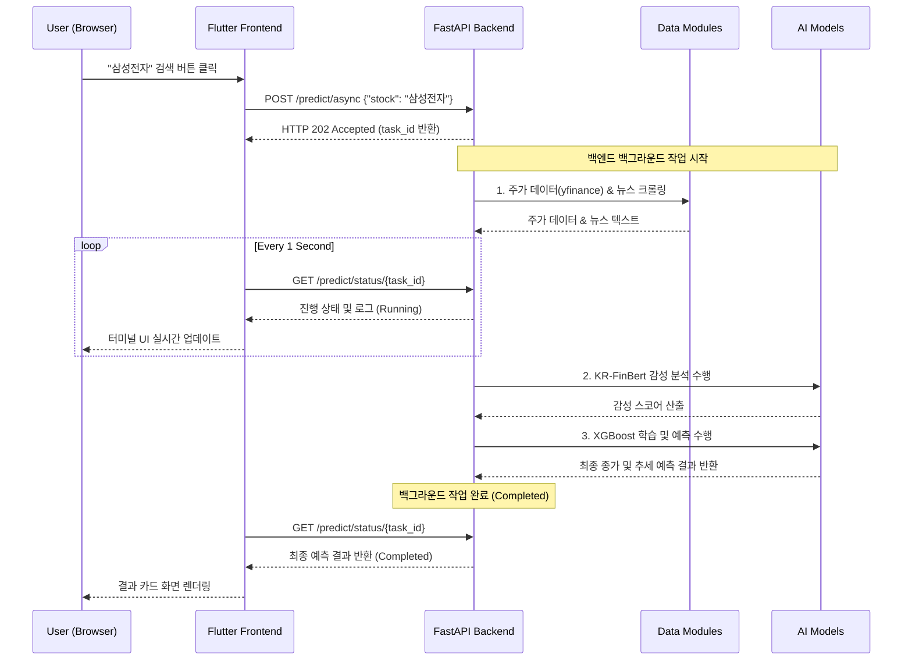

# 📈 Stock Predictor (AI 주가 예측 시스템)

이 프로젝트는 **최신 뉴스 기사의 감성 분석 결과**와 **과거 주가 데이터의 기술적 지표**를 결합하여 다음 날의 주가 및 상승/하락 추세를 예측하는 딥러닝/머신러닝 기반 풀스택 웹 애플리케이션입니다.

## 🌟 주요 기능
1. **실시간 데이터 수집 및 분석 파이프라인**
   - 사용자가 종목명(예: "삼성전자")을 입력하면 백엔드에서 비동기로 실시간 파이프라인을 가동합니다.
   - 데이터 다운로드, 뉴스 크롤링, 감성 분석, 모델 학습, 추론까지 전 과정의 로그가 프론트엔드 터미널 UI에 실시간 중계됩니다. (Polling 방식)
2. **다중 AI 모델을 통한 입체적 예측**
   - **XGBRegressor (회귀 모델)**: 내일의 절대적인 '예측 종가'를 계산합니다.
   - **XGBClassifier (분류 모델)**: 내일 주가가 오를지 내릴지에 대한 '추세(상승/하락)와 확률'을 독립적으로 계산합니다.
   - **KR-FinBert-SC (자연어 처리)**: 수집된 네이버 금융 뉴스들의 텍스트를 분석하여 긍정/부정 감성 스코어를 추출합니다.
3. **해커/터미널 감성의 세련된 UI**
   - Flutter로 제작된 웹 프레임워크 기반의 반응형 프론트엔드.
   - 어두운 배경, 형광색 포인트, 터미널 타이핑 효과를 활용한 사이버펑크 감성.

## 🏗 시스템 아키텍처 및 상호작용

### 1. 시스템 아키텍처 (System Architecture)



### 2. 비동기 처리 및 폴링 시퀀스 (Interaction Sequence)



## 🚀 실행 방법

### 1. Backend 서버 실행
```bash
cd stock_predictor
# 가상환경 활성화 (필요 시)
python -m pip install -r requirements.txt
python main.py
```
> 백엔드 서버는 기본적으로 `http://localhost:8000` 에서 실행됩니다.

### 2. Frontend 서버 실행
```bash
cd stock_predictor/frontend
flutter pub get
flutter run -d web-server --web-port 3000
```
> 프론트엔드 앱은 `http://localhost:3000` 에 호스팅됩니다. 브라우저에서 접속하세요.

## 📌 유의 사항
- 본 시스템의 예측 결과는 **참고용**이며, 실제 주식 투자의 절대적 지표가 될 수 없습니다. 모델은 주어진 데이터 내에서의 패턴을 찾을 뿐, 예측 불가능한 시장 상황을 모두 반영하지는 않습니다.
- KIS(한국투자증권) API 대신 접근성이 좋은 `yfinance`를 국내 주식 데이터 소스로 사용하고 있습니다.
