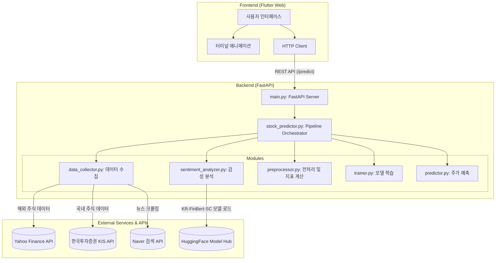

# 주가 예측 시스템 아키텍처 (Stock Predictor Architecture)

지금까지 구축한 **주가 예측 시스템(finbert-xgboost-predictor)**의 전체 아키텍처 구조도입니다. 프론트엔드와 백엔드가 분리되어 있으며, 백엔드 내부에서는 데이터 수집부터 예측까지 파이프라인 형태로 동작합니다.

## 🏗 시스템 구성도 (System Architecture)

## 🧩 주요 컴포넌트 설명

### 1. 프론트엔드 (Frontend)
- **프레임워크**: Flutter Web (`frontend/`)
- **역할**: 사용자가 주식 종목을 검색하고 예측 결과를 시각적으로 확인할 수 있는 웹 UI 제공.
- **주요 기능**: 서버의 처리 과정을 사용자에게 재미있게 보여주기 위한 터미널 타이핑 애니메이션 제공 및 예측 결과 차트 렌더링.

### 2. 백엔드 (Backend)
- **프레임워크**: FastAPI (`main.py`)
- **역할**: 프론트엔드의 예측 요청을 받아 백그라운드에서 예측 파이프라인을 실행하고 결과를 JSON 형태로 반환. (동기/비동기 지원)
- **핵심 모듈 (`modules/`)**:
  - `data_collector.py`: 주식 종목에 따라 분기하여 주가 데이터를 수집합니다. (국내: KIS API, 해외: yfinance). 또한 네이버 검색 API를 통해 관련 뉴스를 수집합니다.
  - `sentiment_analyzer.py`: 수집된 뉴스를 서울대에서 배포한 금융 특화 한국어 언어 모델(`snunlp/KR-FinBert-SC`)을 이용해 긍정/부정/중립으로 분류하고 감성 스코어를 계산합니다.
  - `preprocessor.py`: 주가 데이터와 뉴스 감성 데이터를 병합하고, 이동평균(MA), RSI, MACD, 볼린저 밴드 등 기술적 지표를 계산하여 AI가 학습할 수 있는 Feature 형태로 변환합니다.
  - `trainer.py`: 전처리된 데이터를 기반으로 두 가지 XGBoost 모델을 학습시킵니다. (회귀: 구체적 주가 예측, 분류: 상승/하락 추세 예측)
  - `predictor.py`: 학습된 모델을 로드하여 시장 운영 시간(오전 9시 ~ 오후 3시 30분)에 따라 오늘 종가 또는 다음 거래일 종가를 스마트하게 예측하여 반환합니다.

## 💾 데이터 흐름 (Data Flow)

1. **사용자 요청**: 사용자가 Flutter 앱에서 "삼성전자" 검색.
2. **API 호출**: FastAPI의 `/predict` 엔드포인트로 요청 전달.
3. **종목 매핑**: "삼성전자" → `005930.KS` 변환 및 시장(KOSPI) 판단.
4. **데이터 수집**: 최근 1년 치 주가 데이터 및 관련 뉴스 텍스트 수집.
5. **감성 분석**: 뉴스 텍스트를 분석하여 일별 감성 점수 도출.
6. **전처리 및 학습**: 주가 보조 지표와 감성 점수를 결합하여 XGBoost 모델 학습.
7. **예측 및 응답**: 최신 데이터를 바탕으로 예측을 수행하고 결과를 프론트엔드로 전달.
